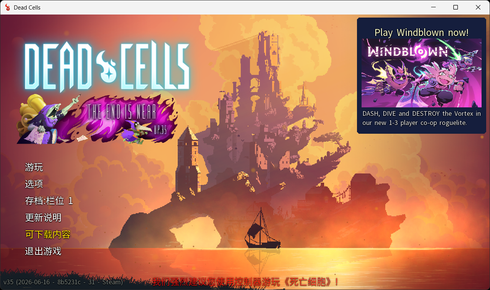
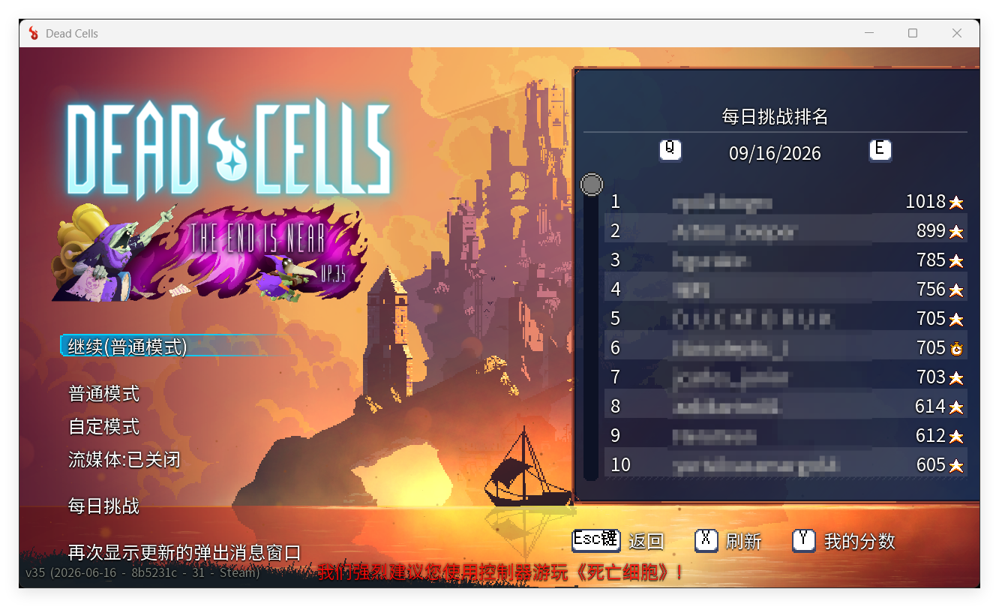
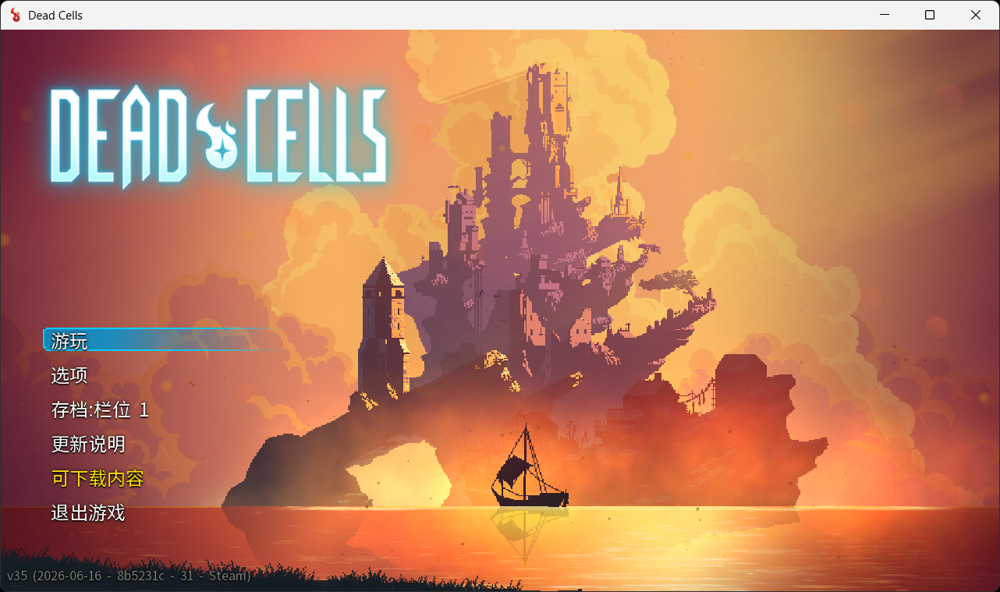
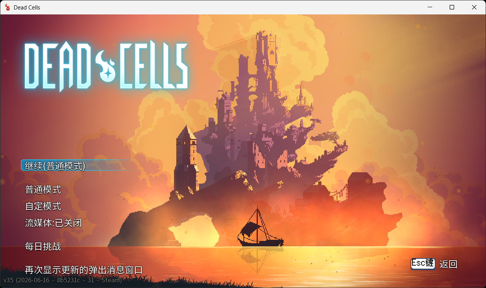
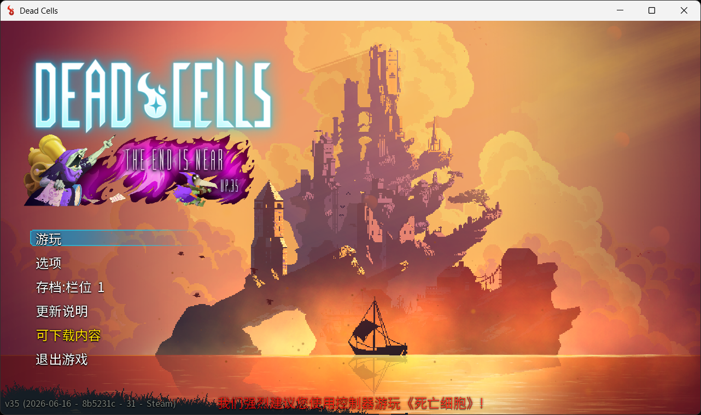
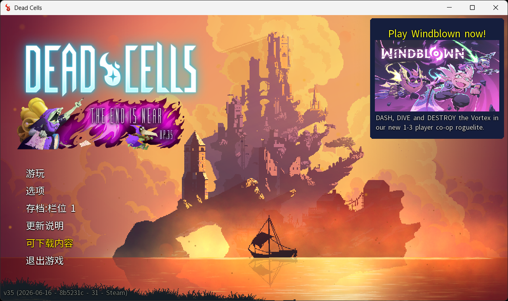
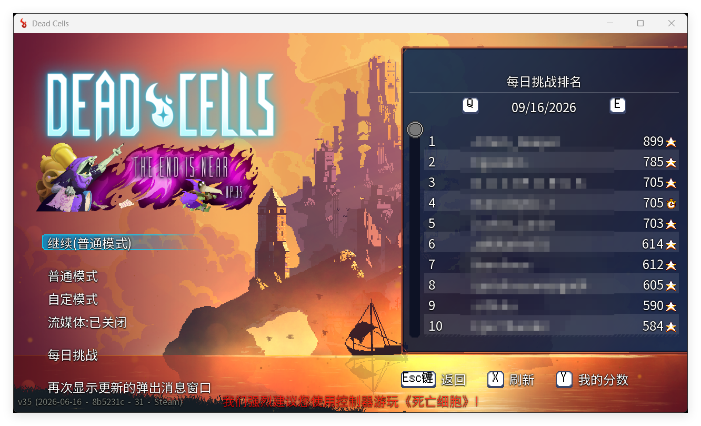
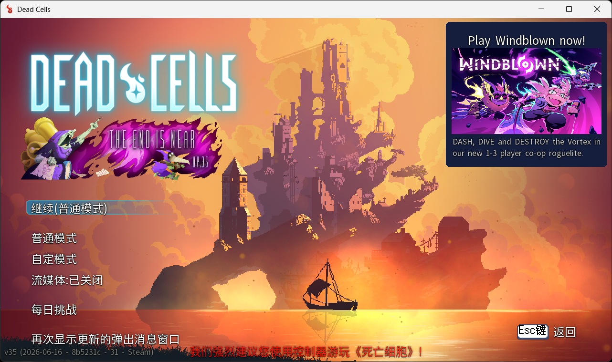
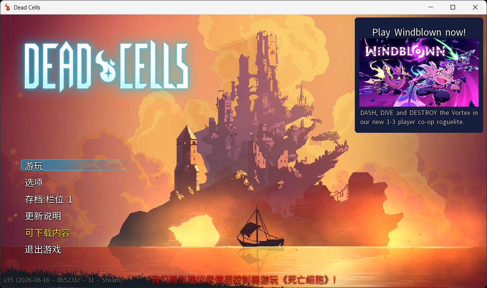

# DeadCells-LaunchTweaks

为 Steam Windows 版《Dead Cells》添加可选启动参数，用于精简启动流程和主菜单界面。

[English documentation](README_EN.md) · [下载最新版本](https://github.com/Hrenact/DeadCells-LaunchTweaks/releases/latest)

> 非官方社区工具，与 Motion Twin、Evil Empire 或 Valve 无关。

## 功能概览

| 启动参数 | 功能 |
| --- | --- |
| `-All` | 一次启用下列全部功能 |
| `-SkipIntro` | 缩短启动画面等待时长 |
| `-NoNewsWindow` | 隐藏延后出现的在线新闻与广告面板 |
| `-NoControllerWarning` | 隐藏菜单底部闪烁的控制器建议文字 |
| `-NoDailyLeaderboard` | 隐藏“游玩”菜单右侧的每日挑战排行榜 |
| `-NoTitleBanner` | 隐藏主界面 Logo 下方的宣传或更新横幅，同时保留菜单布局 |

各参数不区分大小写，可以自由组合或重复填写。只要包含 `-All`，就会启用全部功能。
未识别的参数会原样传递给游戏。

## 效果对比

### 启用全部功能

``` text
-All
```

一次启用全部功能，适合懒得打字且追求极致简洁的资深玩家。

| 原版 | 启用后 |
| --- | --- |
|  <br>  |  <br>  |

### 缩短启动画面

``` text
-SkipIntro
```

缩短工作室 Logo 的等待时长，更快进入主菜单。游戏初始化仍会正常执行。

| 原版 | 启用后 |
| --- | --- |

https://github.com/user-attachments/assets/fc9c8671-2aff-4b0c-9ccc-8115b286870f

### 隐藏新闻广告

``` text
-NoNewsWindow
```

移除进入主菜单后延迟出现的在线新闻区域及其中的推广内容。

| 原版 | 启用后 |
| --- | --- |
|  |  |

### 隐藏控制器建议：`-NoControllerWarning`

| 原版 | 启用后 |
| --- | --- |
|  |  |

移除未连接手柄时位于菜单底部、闪烁显示的红色控制器建议文字。

### 隐藏每日挑战排行

``` text
-NoDailyLeaderboard
```

隐藏“游玩”菜单右侧的每日挑战排行榜并停止其数据刷新。“每日挑战”入口仍然保留。

| 原版 | 启用后 |
| --- | --- |
|  |  |

### 隐藏标题横幅

``` text
-NoTitleBanner
```

隐藏游戏 Logo 下方的宣传或版本横幅，同时保留原有占位高度，因此菜单不会向上移动。

| 原版 | 启用后 |
| --- | --- |
|  |  |

## 安装

1. 从 [Releases](https://github.com/Hrenact/DeadCells-LaunchTweaks/releases/latest) 下载最新版 ZIP。
2. 完整解压 ZIP，关闭《Dead Cells》，然后双击 `Install.cmd`。
3. 在 Steam 库中右键 **Dead Cells**，打开 **属性 > 通用**。
4. 在“启动选项”中填写：

   ```text
   -All
   ```

   也可以只填写需要的单项参数，例如：

   ```text
   -SkipIntro -NoNewsWindow -NoTitleBanner
   ```

5. 此后正常从 Steam 启动游戏。

安装器会自动扫描 Steam 主目录及其他 Steam 库。如果无法定位游戏，它会要求你选择
包含 `deadcells.exe` 的游戏目录。

### 从旧版本升级

关闭游戏后，直接运行新版 `Install.cmd` 即可，无需先卸载。安装器只会替换能够确认
身份的旧版代理，不会覆盖来源不明的可执行文件。从 `DeadCells-NoNewsWindow` 迁移时
也可以直接安装。

## 卸载

1. 关闭《Dead Cells》。
2. 双击 `Uninstall.cmd`，等待原版启动程序恢复。
3. 从 Steam 启动选项中删除本项目的自定义参数。

## 工作原理

安装器不会覆盖唯一一份游戏程序，而是先将原版文件保存为：

```text
deadcells.original.exe
deadcells_gl.original.exe
```

随后，它把小型启动代理放到原来的文件名位置。Steam 启动代理后，代理读取自定义参数，
以挂起状态创建真实游戏进程，只在该次进程的内存中应用经过签名校验的改动，然后恢复
游戏运行。磁盘上的原版程序、`res.pak`、Workshop 内容和存档均不会被修改。

- `-SkipIntro` 修改启动画面的跳过判断。
- `-NoNewsWindow` 将新闻请求路径替换为未使用的等长路径。
- `-NoControllerWarning` 将控制器建议的本地化文本替换为空白。
- `-NoDailyLeaderboard` 让排行榜面板保持隐藏并跳过数据刷新。
- `-NoTitleBanner` 将横幅透明度设为零并刷新渲染状态，但保留布局对象。
- `-All` 在代理内部展开为上述全部开关。

代理会等待真实游戏退出，因此 Steam 的“正在游戏”、游戏时长和覆盖层可以正常工作。

## 兼容性与安全

- 仅支持 Windows x64 与 Steam 版《Dead Cells》。
- 支持 Steam 中的默认渲染器和 OpenGL 启动选项。
- 当前版本已在 Steam v35、build 31（`8b5231c`，2026-06-16）上测试。
- 游戏更新可能改变内部字节码。代理会先验证特征和实时内存，版本不兼容时停止并报错，不会猜测写入位置。
- 更新游戏或验证文件完整性前，建议先运行 `Uninstall.cmd`；完成后再重新安装代理。
- 由于工具会写入自身创建的游戏进程内存，部分安全软件可能进行额外检查。仓库包含完整 C# 与 PowerShell 源码，不依赖第三方运行库。

## 从源码构建

参见 [BUILD.md](BUILD.md)。项目只使用 Windows 自带的 .NET Framework 编译器，
无需 NuGet 包或额外下载依赖。

## 许可证

项目采用 [MIT License](LICENSE)。《Dead Cells》及相关名称归其各自权利人所有。
